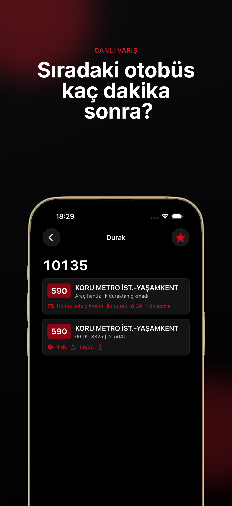
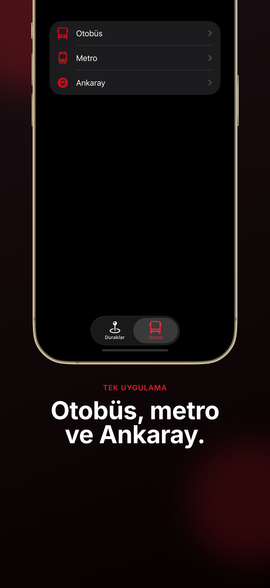
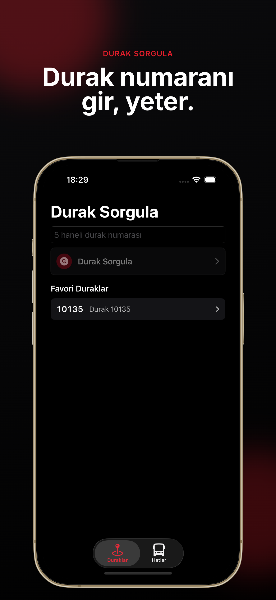
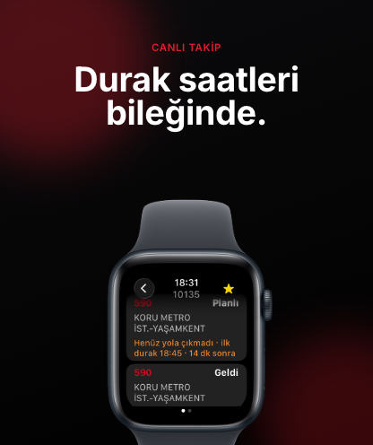
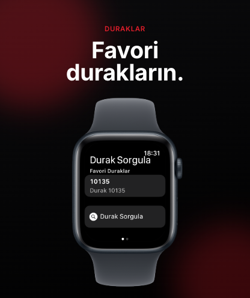
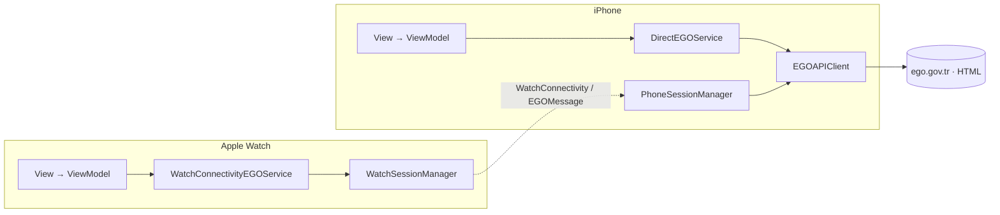

# Ego Takip: EgoWatch

> Ankara EGO toplu taşımasını parmaklarınızın ucuna getiren sade, hızlı ve reklamsız bir ulaşım uygulaması — iPhone ve Apple Watch için.

EGO otobüs, metro ve Ankaray hatlarını tek bir yerden takip edin: durağa yaklaşan otobüsleri canlı görün, sefer saatlerini ve güzergahları inceleyin, favori durak ve hatlarınızı tek dokunuşla sorgulayın.

<p align="center">
  
  
  
</p>
<p align="center">
  
  
</p>

---

## Özellikler

- **Otobüs Nerede** — 5 haneli durak numaranızı girin; yaklaşan otobüsleri, tahmini varış sürelerini ve sıradaki durak bilgisini anlık görün.
- **Hat & Sefer Saatleri** — Otobüs, metro ve Ankaray hatlarını arayın; kalkış noktası, güzergah, mesafe, sefer süresi ve hafta içi / Cumartesi / Pazar saatlerini görüntüleyin.
- **Geçtiği Duraklar** — Bir hattın tüm güzergahını ve durduğu durakları sırasıyla inceleyin.
- **Favoriler** — Sık kullandığınız durak ve hatları cihazda saklayın, tek dokunuşla anında sorgulayın.
- **Apple Watch** — En çok kullandığınız durak ve hatları doğrudan bileğinizden kontrol edin.
- **Gizlilik odaklı** — Konum izni istemez, hesap gerektirmez, veri toplamaz. Reklamsız, koyu temalı arayüz.

---

## Teknik Detaylar

### Yığın (stack)

| | |
|---|---|
| **Diller** | Swift 5, SwiftUI |
| **Platformlar** | iOS (iPhone), watchOS — min. OS 26.1 |
| **Mimari** | MVVM + paylaşımlı çekirdek (`Shared/`) |
| **Eşzamanlılık** | `async/await`, `Sendable`, MainActor varsayılan izolasyon |
| **Cihazlar arası** | WatchConnectivity |
| **Bağımlılık** | Yok (sadece Apple SDK'ları) |
| **Bundle ID** | `com.alpermelkeli.egowatch` |

### Proje yapısı

```
ios/
├── Shared/                     # iOS + watchOS hedeflerinin paylaştığı çekirdek
│   ├── Models/                 # BusArrival, BusLine, LineSchedule, TransitType
│   ├── Networking/             # EGOEndpoint, EGOAPIClient, EGOHTMLParser, EGOAPIError
│   ├── Services/               # EGOService (protokol) + uygulamaları
│   ├── ViewModels/             # StopViewModels, LineViewModels
│   ├── Views/                  # EGOSharedViews, EGOTheme (koyu tema, kırmızı vurgu)
│   ├── Favorites/              # Cihaz-içi favori saklama
│   └── Connectivity/           # EGOMessage (telefon↔saat mesaj sözleşmesi)
├── egowatch/                   # iPhone uygulaması (ContentView, IOS*Views, PhoneSessionManager)
└── egowatch Watch App/         # watchOS uygulaması (Watch*Views, WatchSessionManager)
```

### Veri katmanı — EGO'nun HTML'ini kazımak

EGO'nun herkese açık bir JSON API'si **yoktur**; `ego.gov.tr` form-encoded `POST` isteklerine **HTML** döndürür. Uygulama bu HTML'i tipli modellere çevirir:

- **`EGOEndpoint`** — `application/x-www-form-urlencoded` gövdeli `POST` isteklerini kurar. Üç uç nokta: `/otobusnerede` (durak no), `/HareketSaatleri` (hat saatleri), ve tür bazlı hat listesi yolları. Sunucunun beklediği `Referer` başlığı ve 20 sn timeout ayarlanır.
- **`EGOAPIClient`** — `nonisolated`, `Sendable` bir `struct`. `URLSession` ile `async/await` üzerinden istek atar, girişleri doğrular (ör. durak no tam 5 hane ve rakam), HTTP durum kodlarını denetler ve ayrıştırmayı `EGOHTMLParser`'a devreder.
- **`EGOHTMLParser` / `HTMLDecoding`** — `.bus-card`, `.route-badge`, `.eta`, `.route-meta` gibi DOM bloklarını ayrıştırıp HTML entity'lerini çözer (gerçek yanıt örnekleri: [`docs/api-samples/`](docs/api-samples)).
- **`EGOAPIError`** — `invalidStopNumber`, `parsingFailed`, `network`, `server(statusCode:)` gibi tipli hatalar.

Uç nokta ayrıntıları ve örnek istek/yanıtlar için: [`docs/ego-api.md`](docs/ego-api.md).

### Apple Watch → iPhone vekil mimarisi

Saat, EGO'ya **doğrudan gitmez** — istekleri eşleşmiş iPhone'a iletir. Bu, `EGOService` protokolünün iki uygulamasıyla soyutlanır:



- **iPhone:** `DirectEGOService` → `EGOAPIClient` → EGO.
- **Apple Watch:** `WatchConnectivityEGOService` → `WatchSessionManager` → (WatchConnectivity) → iPhone'daki `PhoneSessionManager` → `EGOAPIClient` → EGO.

Böylece tüm ağ/ayrıştırma mantığı tek yerde (telefonda) kalır; saat hafif tutulur ve istekler telefonun bağlantısını kullanır.

---

## Derleme & Çalıştırma

```bash
open "ios/egowatch.xcodeproj"   # veya " .xcodeproj"
```

- **Gereksinimler:** Xcode (iOS/watchOS 26.1 SDK), bir Apple geliştirici hesabı (imzalama otomatik).
- iOS hedefi yalnızca iPhone içindir (`TARGETED_DEVICE_FAMILY = 1`).
- Çalıştırmak için iPhone şemasını seçin; Apple Watch uygulaması eşleşmiş saat/simülatörde gelir.

---

## Depo düzeni

Bu **monorepo** uygulamayı ve yardımcı dosyaları içerir. Web sitesi ayrı bir depoda yaşar ve buraya **submodule** olarak bağlıdır (URL'i sabit tutmak için):

```
egowatch/
├── ios/                # iPhone + Apple Watch uygulaması
├── screenshots/        # App Store pazarlama görselleri (iPhone 6.9" + Apple Watch)
├── metadata-current/   # App Store Connect liste metası (tr)
├── docs/               # EGO API notları ve örnek yanıtlar
└── website/            # submodule → github.com/alpermelkeli/egowatch-site (GitHub Pages)
```

> Submodule'lü klonlamak için: `git clone --recursive` veya klon sonrası `git submodule update --init`.

- **Web sitesi:** https://alpermelkeli.github.io/egowatch-site/ ([gizlilik](https://alpermelkeli.github.io/egowatch-site/privacy.html) · [destek](https://alpermelkeli.github.io/egowatch-site/support.html))

---

## Sorumluluk reddi

Ego Takip (EgoWatch) **bağımsız** bir uygulamadır; resmi bir EGO ürünü **değildir** ve Ankara Büyükşehir Belediyesi EGO Genel Müdürlüğü ile bağlantısı yoktur. Yalnızca `ego.gov.tr` üzerindeki herkese açık verileri kullanır. Veriler gerçek zamanlı olarak EGO'dan alınır; EGO sunucularındaki yoğunluk veya kesintilerde gecikebilir.

## Lisans

© 2026 Alper Melkeli. Tüm hakları saklıdır.
